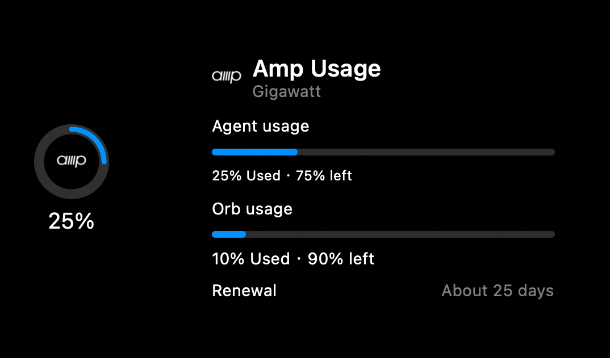
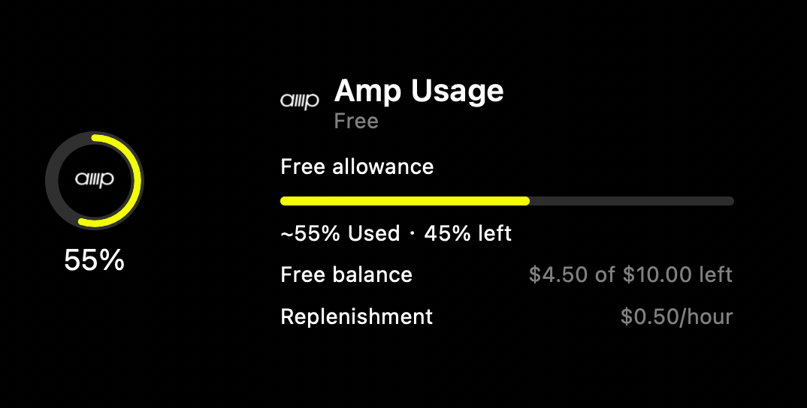

# Amp

Codenotch for macOS reads the Amp CLI login from
`~/.local/share/amp/secrets.json`. Run `amp login`, then refresh Codenotch.
Enable or disable Amp in **Settings → Accounts** like any other provider.
Disabling it stops polling and forgets Codenotch's readings; it leaves the
Amp login file untouched.

## Readings

- **Subscription:** Agent usage is the headline ring. Orb usage is a separate
  tooltip row. Amp reports percentages remaining; Codenotch shows the
  complementary percentages used with `.official` fidelity. Both the older
  `Amp … Subscription` format and the current `Amp … Tier` format are supported.
  The latter includes dollar balances and orb-hour allowances; the ring uses
  Amp's own reported percentages rather than recalculating them from amounts
  and implying greater precision than the CLI displays.
- **Renewal:** Amp's integer days appear as an approximate text row. They are
  not precise enough to supply a reset timestamp or a cycle duration.
- **Amp Free:** the headline is the fraction consumed from the reported dollar
  allowance, with `.derived` fidelity. The tooltip retains the remaining and
  total dollars and the hourly replenishment rate. Continuous replenishment
  is not presented as a scheduled reset.

Neither Orb usage nor the Free allowance is a weekly quota, so neither creates
a weekly ring. This adapter does not track agent activity or invent a quota
for credit-only accounts whose response has no supported allowance.

The following screenshots render the app's actual ring and tooltip with
synthetic test fixtures, not live account data:





## Source and credentials

The adapter sends a read-only JSON-RPC method to Amp's own internal endpoint:

```http
POST https://ampcode.com/api/internal
Authorization: Bearer <Amp CLI key>
Content-Type: application/json

{"jsonrpc":"2.0","method":"userDisplayBalanceInfo","params":{},"id":1}
```

Only the `apiKey@https://ampcode.com/` entry (also accepted without the trailing
slash) is used. Keys for other servers in the same file are ignored. The file
is re-read on refresh, so logging in again or rotating the key needs no app
restart. No credential is copied, refreshed, logged, or written by Codenotch.

OAuth-based CLI logins can store a short-lived access token in that entry.
This adapter does not use the CLI's refresh token or renew access tokens.
If a previously working account returns an authentication error, run
`amp usage` in Terminal to let the CLI renew its token, then refresh Codenotch.
If the CLI also needs authentication, run `amp login`. Automatic OAuth renewal
is not included in this adapter.

The endpoint returns `result.displayText`, or a flat `displayText`, rather than
structured quota fields. Its wording is an internal contract and can change.
Unknown or invalid responses show an error, never a fabricated 0%.

Missing credentials and HTTP 401/403 show `amp login` guidance. Unreadable or
malformed credential files show a storage error. HTTP 429 persists a wait of at
least one minute and honors `Retry-After`, including HTTP dates. Other failures
use Codenotch's normal last-good-reading/stale behavior.

## References

- [Amp security reference](https://ampcode.com/security) documents the CLI credential path.
- [OpenUsage issue #1188](https://github.com/robinebers/openusage/issues/1188)
  links to [iamgp's Amp implementation](https://github.com/iamgp/openusage/tree/main/Sources/OpenUsage/Providers/Amp),
  the reference for the request and synthetic response fixtures used here.
- The template glyph uses the wordmark path from [Amp's own app icon](https://ampcode.com/app-icon.svg?v=4),
  without its background or shadow.

## Validation

`make test` covers parsing, invalid values, credential isolation and rotation,
the HTTP request, authentication and transport failures, persisted throttling,
disconnect behavior, and rendering. Tests use synthetic data and isolated
temporary files, URL sessions, and preference stores by default.

After `amp login`, explicitly enable the live provider/store check with:

```sh
TEST_RUNNER_CODENOTCH_TEST_AMP_LIVE=1 make test
```

That check reads the actual CLI credential and requests live usage. It prints
only the parsed metering values, not the key or account identity, and keeps its
archive separate from the app's preferences.

For an account check, compare the Agent/Orb percentages with Amp's usage view
after `amp login`. Do not commit live responses, account identifiers, or keys.
